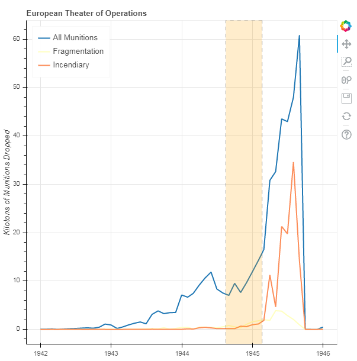

# Exploring data of WWII with pandas and Bokeh
This is something I made following this blog: [Visualizing with bokeh](https://programminghistorian.org/en/lessons/visualizing-with-bokeh)

## Check out the Plots

1. Plotting a Single Glyph 

2.  Plotting with the ColumnDataSource and More Styling Options

3.  A Bar Chart with Categorical Data and Coloring

4.  A Stacked Bar Chart with Categorical Data and Coloring

5.  A Time-Series Plot with Data Resampled to Months

6.  A Time-Series Plot of the ETO with Annotations Added

7.  A Map of Target Locations

